## **概述**
  本文档的内容是使用BixinKEY测试第三方App的方法和结果。  
  分为两部分：
  - trezor官网验证过的APP(参见https://wiki.trezor.io/Apps),这部分会挑常用的、流程复杂的详细描述，其他的只给链接，不做详细介绍
  - 官网中没提到的目前流行的支持TREZOR的APP


## <br/>**TREZOR官网支持的APP**</br> 
###  <br/>**Trezor网页版APP**</br>
#### &nbsp;环境搭建
  &nbsp;注意 本文概述的步骤针对在运行Windows，macOS或Linux的计算机上使用Chrome或Firefox浏览器
  - 安装bridge插件(https://wallet.trezor.io/#/bridge)  注意在Chrome中，您也可以使用WebUSB连接设备，而在Firefox中，Bridge是唯一的选择
  - 将BixinKEY插入PC，并打开trezor网址(https://trezor.io/), 点击“I already own Trezor”按钮，选择你的设备型号，连接进入BixinKEY
  - Passphrase密语设置，BixinKEY默认设置密语，如果不使用直接点击Enter跳过

#### &nbsp; 创建一个钱包
  - 未激活的BixinKEY 点击“Create wallet” 创建一个新的钱包，会生成Account信息  
  - 已激活的BixinKEY 进去以后就有对应的Account信息

#### &nbsp; 发币
  
  - 点击左侧任意一个Account
  - 在上方的菜单中点击“接收”菜单，查看完整地址并在BixinKEY上再次检查及确认
  - 向该地址发送比特币，收到钱之后，账户的余额会增加，可以发币
  - 在上方的菜单中点击“发送”菜单，输入地址金额并选择费率，点击发送按钮
  - 在BixinKEY上确认交易信息并签名，收币地址收到测试币，发币成功

#### &nbsp; 结果
  - 可以使用BixinKEY
 

### <br/>**Electrum客户端**</br>
#### &nbsp; 环境搭建
  #### &nbsp; LINUX(Ubuntu 18.04)
  ```
    wget https://download.electrum.org/3.3.8/Electrum-3.3.8.tar.gz
    tar -xvf Electrum-3.3.8.tar.gz
    sudo apt-get install libusb-1.0-0-dev libudev-dev
    python3 -m pip install trezor[hidapi]
    python3 Electrum-3.3.8/run_electrum
  ```
#### &nbsp; 创建一个钱包
  - 根据Create New Wallet的索引创建一个硬件钱包，大概流程如下：<br/>
    **Create New Wallet-->Standard wallet-->Use a Hardware device-->Enter Passphrase(不想输入密语，直接pass)-->选择一个钱包地址类型，默认P2WPKH-->next-->next**
 
#### &nbsp; 发币
  - 点击Send按钮，输入Pay to(输出地址)和Amount(发送金额)，点击pay</br>
    <br/></br>
  - 拖拽选择fee，点击Finalize(完成)，进入签名页面</br>
    <br/></br>
  - 点击签名，此时需要在BixinKEY上点击确认按钮</br>
  - 点击broadcast按钮，广播交易</br>
    <br/></br>
  - 回到历史记录页面可以看到未确认的交易</br>
    <br/></br>
#### &nbsp; 结果
  - 可以使用BixinKEY

### <br/>**MetaMask**</br>
#### &nbsp; 环境搭建
  ##### 参考使用地址：
    https://wiki.trezor.io/Apps:MetaMask
    https://metamask.zendesk.com/hc/en-us/articles/360020394612-How-to-connect-a-Trezor-or-Ledger-Hardware-Wallet
  #### &nbsp; Linux/Windows/MacOS
  必备条件：
   - 翻墙
   - 浏览器必须为google chrome或者firefox
   - 安装bridge插件
      - (https://wallet.trezor.io/#/bridge)(打开网址,直接点击下载最新包就行,因为系统会自动匹配对应安装包)
        <br/>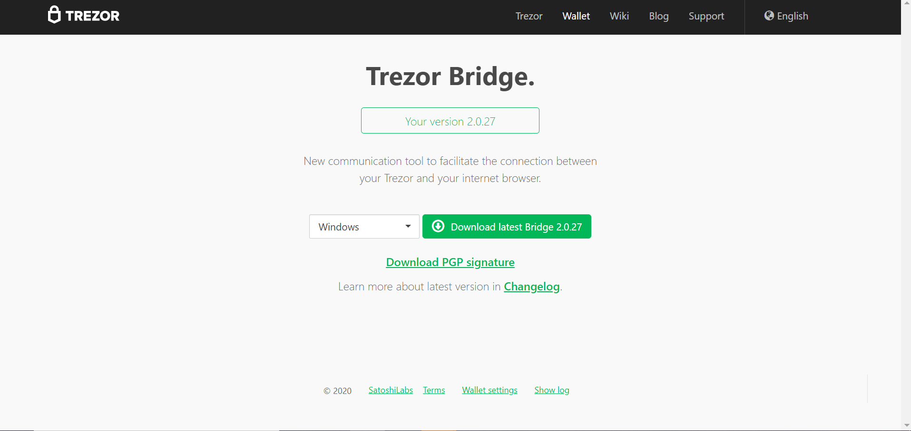</br>
      - 下载完成之后，点击下载的文件直接进行安装
        - Window 安装：
          <br/></br>
        - Linux 安装：
          <br/>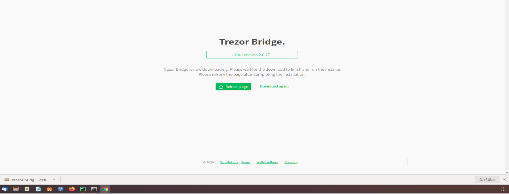</br>
          ————————————————————————————————————————————————————
          <br/>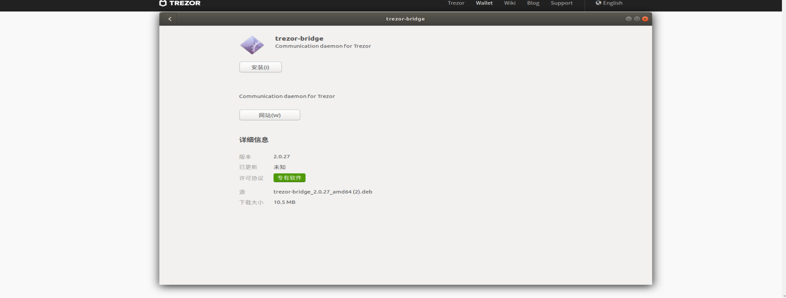</br>
        - MacOS 安装：
          <br/>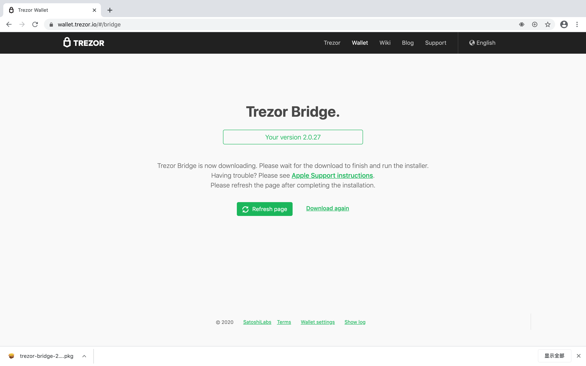</br>
          ————————————————————————————————————————————————————
          <br/>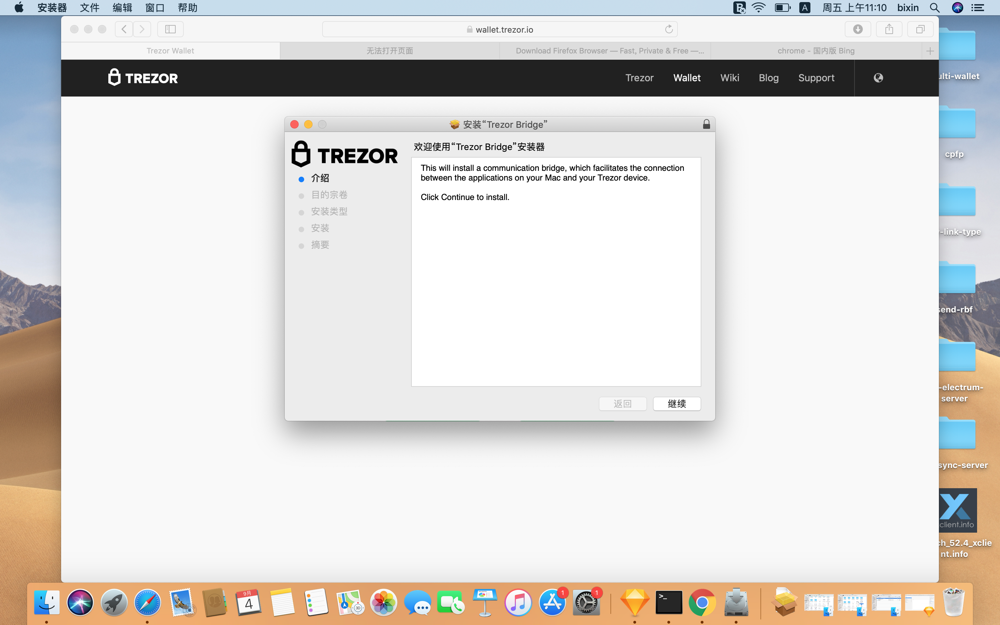</br>
  #### &nbsp; 连接BixinKey
  - 在chrome中输入以下网址添加metamask扩展模块(https://chrome.google.com/webstore/detail/metamask/nkbihfbeogaeaoehlefnkodbefgpgknn)
    - 点击“添加至chrome”按扭，跳出新窗口，点击“添加扩展”按钮，显示“正在检查”(这里稍微需要点儿时间)，检查完成会进入MetaMask首页，点击“开始使用”
    <br/>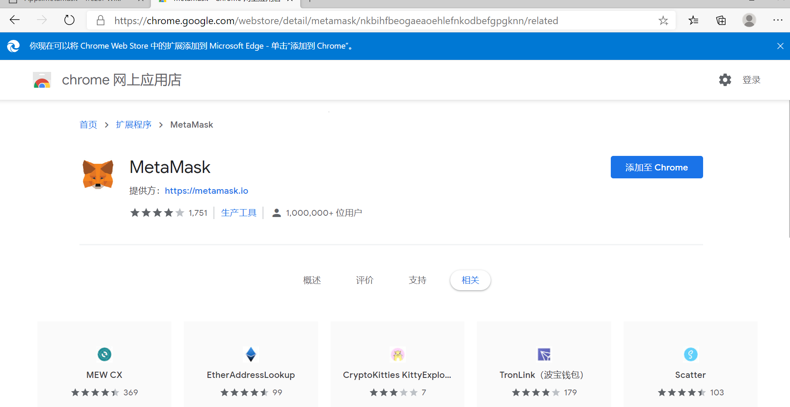</br>
    ——————————————————————————————————————————————————————————
    <br/>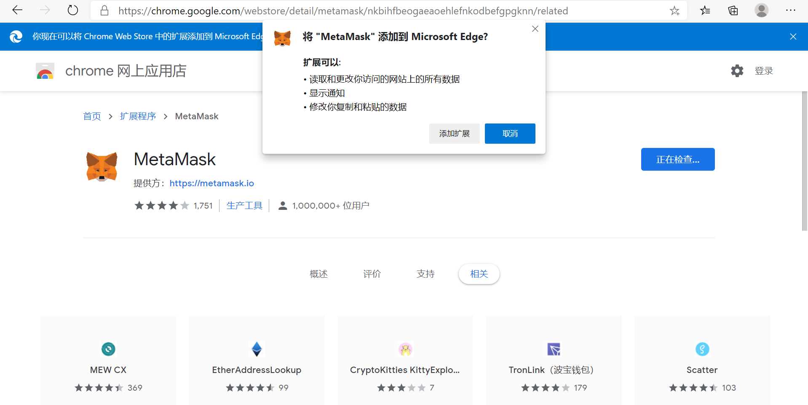</br>
    ——————————————————————————————————————————————————————————
    <br/>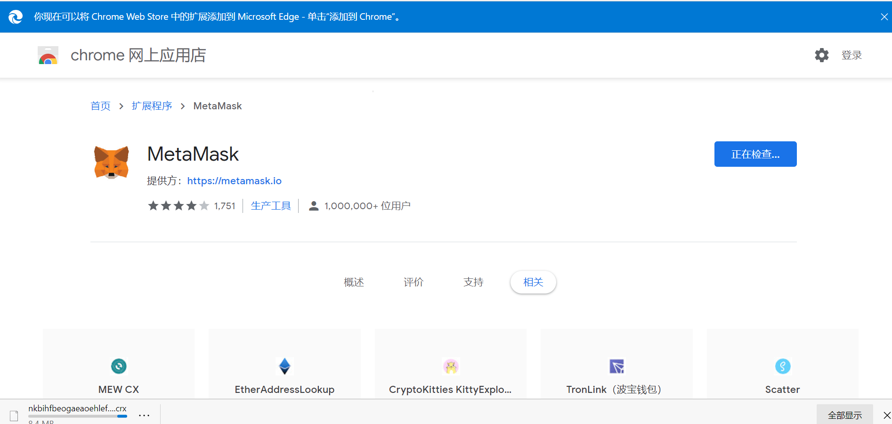</br>
    ——————————————————————————————————————————————————————————
    <br/>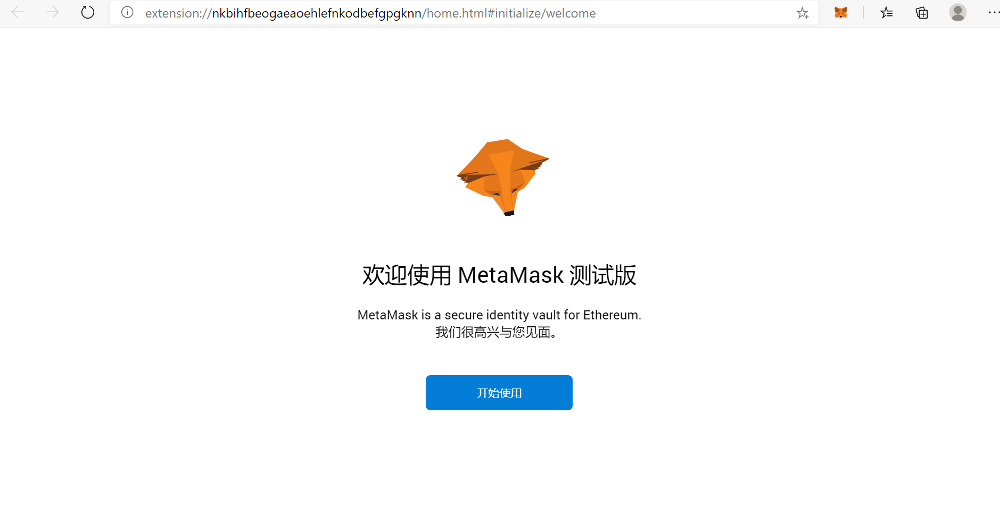</br>
    - 创建钱包(因为我已经有SEED，所以选择导入钱包),输入seed点击“导入”按钮后进入首页
    <br/>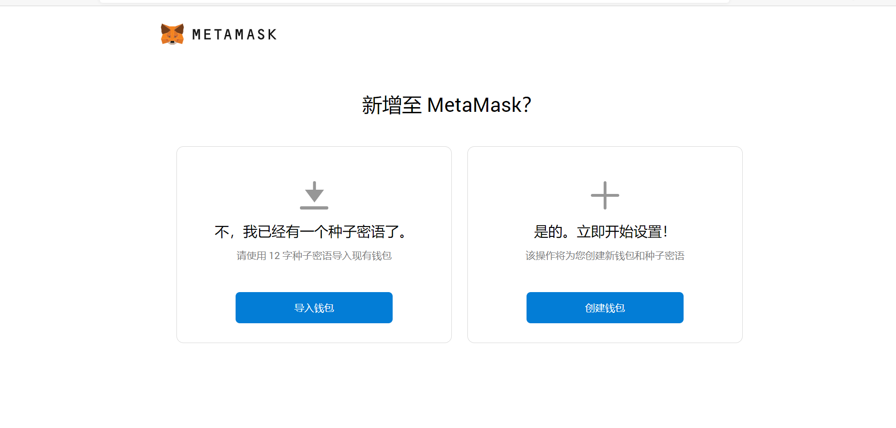</br>
    ——————————————————————————————————————————————————————————
    <br/>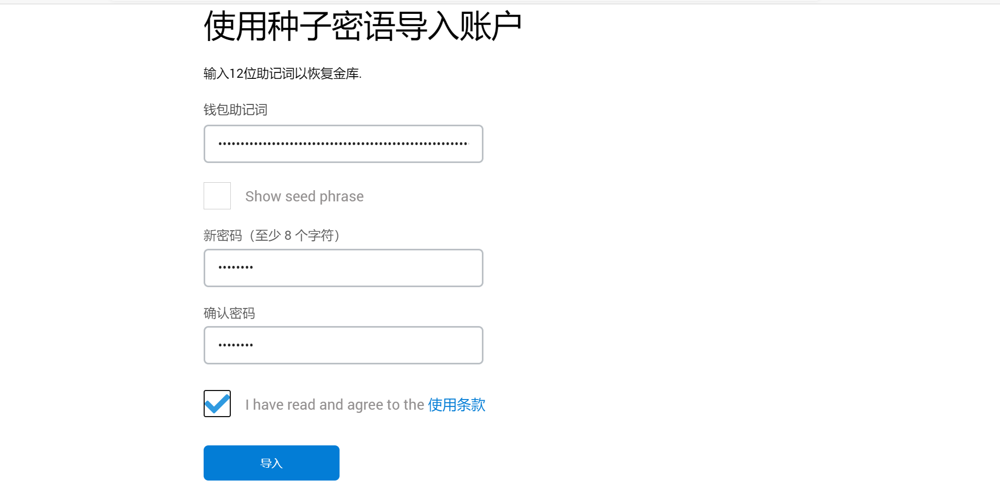</br>
    ——————————————————————————————————————————————————————————
    <br/>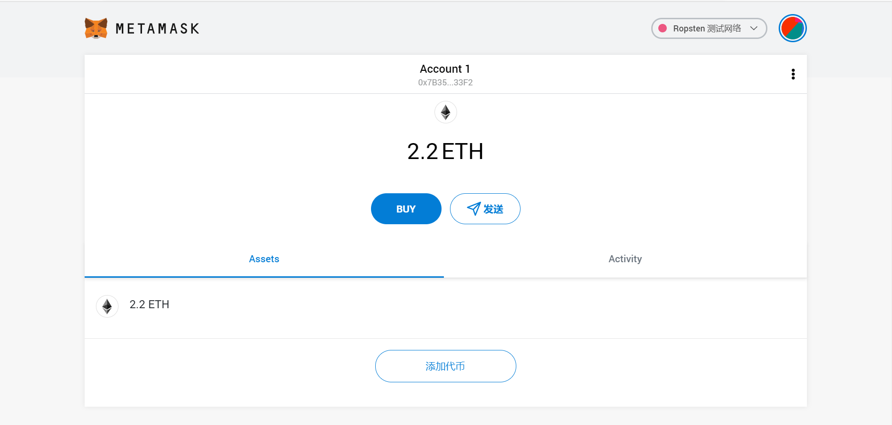</br>
    - 点击右上角的头像，选择"链接硬件钱包"
    <br/>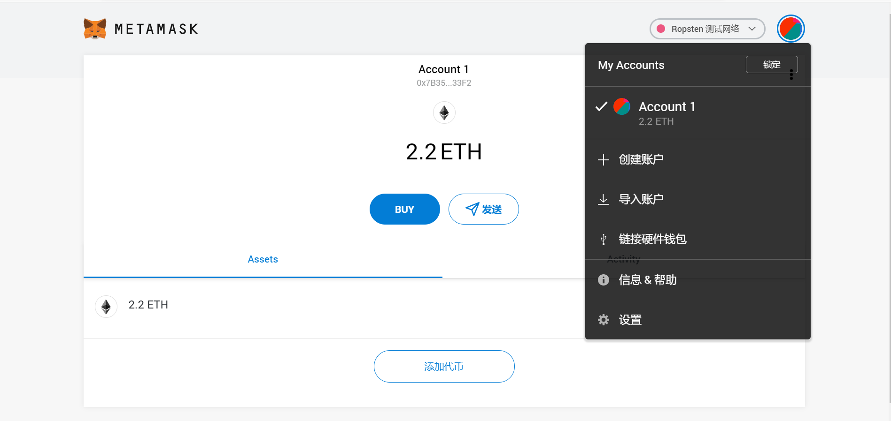</br>
    - 插入硬件，选择“trezor”，并点击连接，跳出新页面点击"allow once for this session",然后点击“Export”，输入密码，可以看到trezor中对应的账号信息，选择对应账号信息进行解锁(此处如果不能成功选择，建议重启浏览器)，可以看到对应账户信息
    <br/>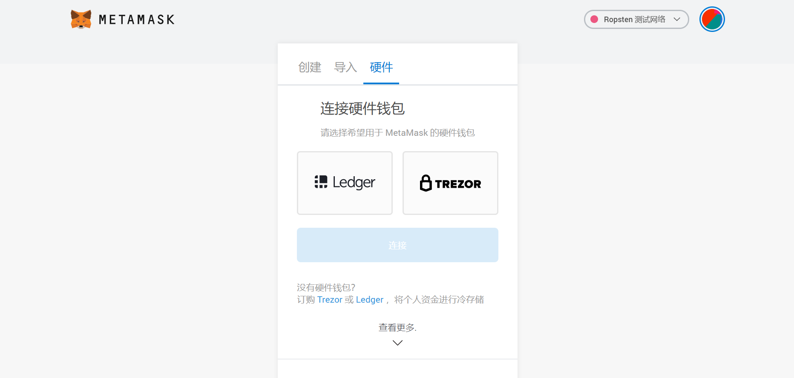</br>
    ——————————————————————————————————————————————————————————
    <br/>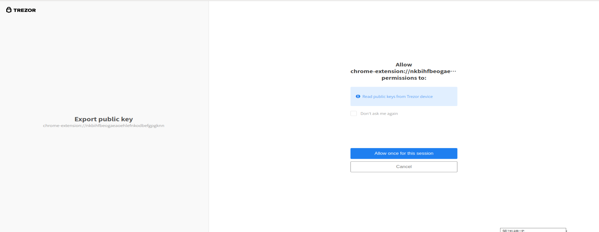</br>
    ——————————————————————————————————————————————————————————
    <br/>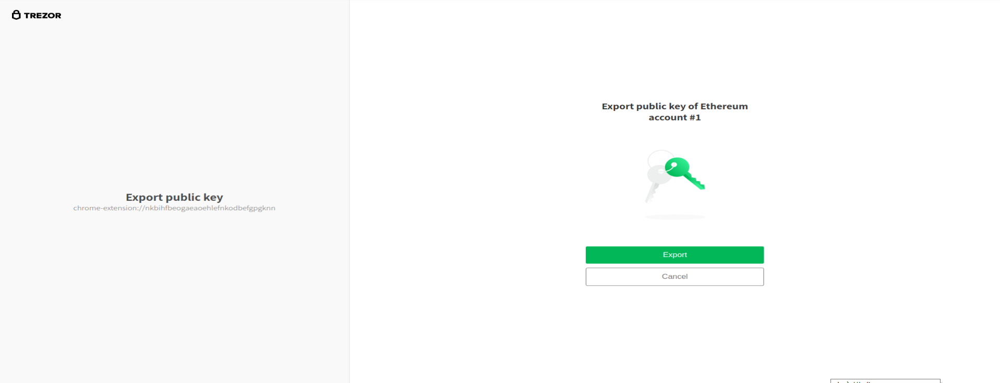</br>
    ——————————————————————————————————————————————————————————
    <br/>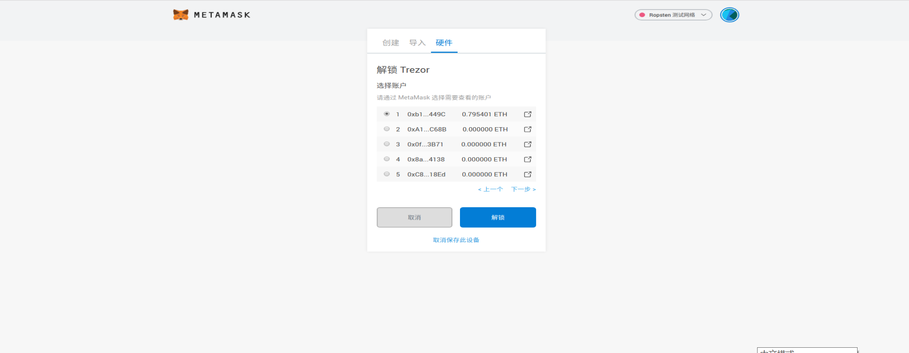</br>
    ——————————————————————————————————————————————————————————
    <br/></br>
  #### &nbsp; 发币
  - 点击发送按钮，输入接收地址，输入金额，并选择费率，点击下一步，确认交易信息，没问题就点击确认按钮，点击proceed按钮，跳出新页面点击"allow once for this session",去硬件上进行确认，硬件上确认完成后页面会自动跳转到交易列表页面(此处会有大概30秒的超时，超时没确认会显示发送失败)
    <br/></br>
    ——————————————————————————————————————————————————————————
    <br/>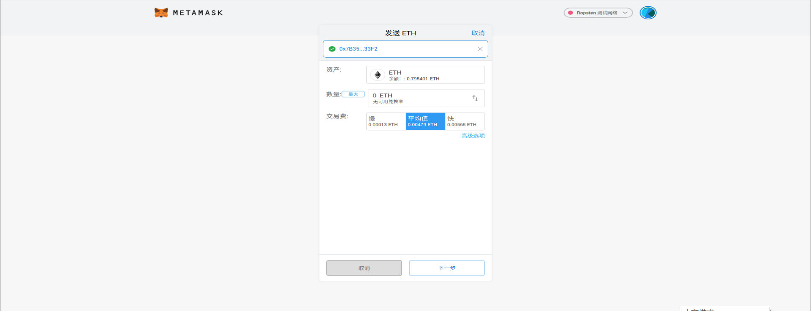</br>
    ——————————————————————————————————————————————————————————
    <br/></br>
    ——————————————————————————————————————————————————————————
    <br/>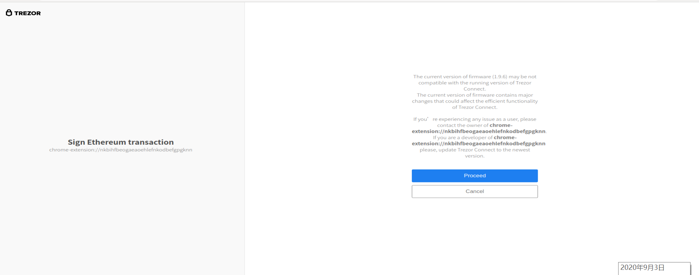</br>
    ——————————————————————————————————————————————————————————
    <br/>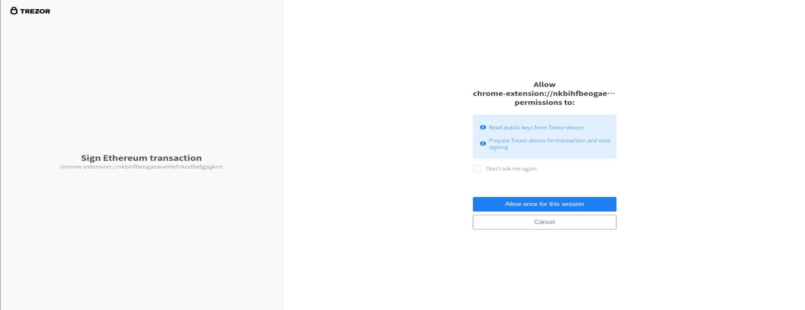</br>
    ——————————————————————————————————————————————————————————
    <br/>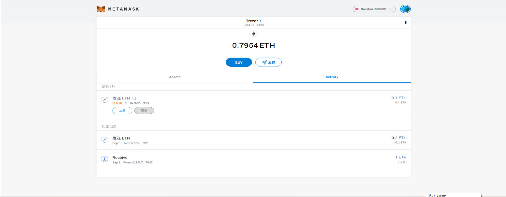</br>
  #### &nbsp; 结果
  - 可以使用BixinKEY

### <br/>**Mycelium**</br>
### &emsp; <font face="黑体" size=3>参考使用地址：https://wiki.trezor.io/Apps:Mycelium</font>  

  
### <br/>**Exodus**</br>
### &emsp; <font face="黑体" size=3>参考使用地址：https://wiki.trezor.io/Apps:Exodus</font>    


### <br/>**Electrum-DASH**</br>
### &emsp; <font face="黑体" size=3>参考使用地址：https://wiki.trezor.io/Apps:Electrum-DASH</font>   


### <br/>**Electrum-LTC**</br>
### &emsp; <font face="黑体" size=3>参考使用地址：https://wiki.trezor.io/Apps:Electrum-LTC</font>   


### <br/>**Etherwall**</br>
### &emsp; <font face="黑体" size=3>参考使用地址：https://wiki.trezor.io/Apps:Etherwall</font>      


### <br/>**Electrum-DASH**</br>
### &emsp; <font face="黑体" size=3>参考使用地址：https://wiki.trezor.io/Apps:Electrum-DASH</font>    


### <br/>**MyCrypto**</br>
### &emsp; <font face="黑体" size=3>参考使用地址：https://wiki.trezor.io/Apps:MyCrypto</font>    


### <br/>**MyEtherWallet**</br>
### &emsp; <font face="黑体" size=3>参考使用地址：https://wiki.trezor.io/Apps:MyEtherWallet</font>    


### <br/>**Nano Wallet**</br>
### &emsp; <font face="黑体" size=3>参考使用地址：https://wiki.trezor.io/Apps:Nano_Wallet</font>    


### <br/>**Walleth**</br>
### &emsp; <font face="黑体" size=3>参考使用地址：https://wiki.trezor.io/Apps:Walleth</font>    


## <br/>**市面流行的支持BixinKEY的APP**</br>
### <br/>**Bitcoin core + Specter-Desktop**</br>
#### &nbsp;环境搭建
#### &nbsp;LINUX(Ubuntu 18.04)
#### &nbsp;搭建regtest私有链:
  - git clone https://github.com/bitcoin/bitcoin.git
  - cd bitcoin
  - ./autogen.sh
  - ./configure
  - make
  - 修改配置文件
    ```
      server=1
      txindex=1
      rpcuser=bitcoinrpc
      rpcpassword=bitcoinrpc
      rpcallowip=192.168.255.144
      regtest=1
      [regtest]
      rpcport=18443
    ```
  - src/bitcoind -daemon


#### &nbsp;搭建跟HW通讯的可视化GUI:
  - 安装Specter-Desktop(Specter-Desktop是专门为了方便bitcoin和硬件钱包交互设计的一个GUI，参考：https://github.com/cryptoadvance/specter-desktop)  
    ```
      python3 -m pip install cryptoadvance.specter
      python3 -m cryptoadvance.specter server
    ```  
  - 在浏览器中打开网址：http://127.0.0.1:25441/，可以进入UI界面，连接BixinKEY创建钱包及收币
#### &nbsp;创建一个钱包
  - 点击左侧"Add new wallet"，选择创建个人钱包还是多签钱包(个人钱包目前测试没问题，多签创建不成功)
    <br/></br>
  - 选择钱包类型(Nested Segwit还是Segwit)，选择“trezor设备”，点击continue进入钱包  
    <br/></br>
#### &nbsp;发币
  - 点击左侧账户，再点击send，填写地址和金额
    <br/></br>
  - 最后点击trezor按钮，确定用trezor来签名此次交易  
    </br></br>
  - 在BixinKEY上确认交易，如设置PIN则会有弹窗要求输入PIN
  - 广播交易
    <br/></br>
  - 在收币地址收币成功
    <br/></br>
#### &nbsp;结果
  - 可以使用BixinKEY

### <br/>**bitcoin core+HWI**</br>  
#### &nbsp;环境搭建
#### &nbsp;LINUX(Ubuntu 18.04)
  &nbsp;参考网址：https://github.com/bitcoin-core/HWI/blob/master/docs/bitcoin-core-usage.md  
#### 搭建regtest私有链：
  - 同"Bitcoin core + Specter-Desktop"中搭建流程一致  
  
#### 搭建HWI运行环境：
  - sudo apt install libusb-1.0-0-dev libudev-dev python3-dev
  - git clone https://github.com/bitcoin-core/HWI.git
  - cd HWI
  - pip3 install -U setuptools
  - python3 setup.py install
  
#### &nbsp; 查找硬件
  - ./hwi.py enumerate (查找硬件)
  - ./hwi.py --device-type trezor --testnet getkeypool --wpkh 0 1000 (生成key) 
#### &nbsp; 创建一个钱包
  - bitcoin-cli -regtest createwallet "trezor0" true (创建钱包)
  - bitcoin-cli -regtest -rpcwallet='trezor0' importmulti 'keypool'(keypool为查找硬件中第二步的返回值)

    <br/>此图为查找硬件和创建钱包的具体实例：</br>
        </br>
#### &nbsp; 发币
  - bitcoin-cli -regtest -rpcwallet=trezor0 walletcreatefundedpsbt '[]' '[{"2NDnUB67K9mdx2vyqaaf2YbmXaMtoDdfWFc":1}]' 0 '{"includeWatching":true}' true (创建交易，返回psbt1)  
  - bitcoin-cli -regtest decodepsbt pbst1 (查看交易详情)

    <br/></br>

  - ./hwi.py --device-type trezor --testnet signtx pbst1 (签名交易)
  - bitcoin-cli -regtest finalizepsbt psbt1 (删除一些数据，生成可广播的十六进制的rawtx)
  - bitcoin-cli -regtest sendrawtransaction rawtx(rawtx 是上一步返回的hex后对应的数据,返回一个tx_hash)
    <br/></br>
#### &nbsp; 结果
  - 查看结果方法：
    ```
      bitcoin-cli -regtest -rpcwallet=receive_wallet listreceivedbyaddress (查看接受地址钱包的地址列表，可以看到上一步广播后返回的交易tx_hash)
    ```  
    <br/></br>
  - 可以使用BixinKEY


### <br/>**BTCPayServer**</br>  
#### &nbsp;环境搭建
#### &nbsp;LINUX(Ubuntu 18.04)
  &nbsp;参考网址：https://github.com/justinmoon/junction  
#### &nbsp;安装比特币核心0.19.1
  ```
    BITCOIN_VERSION="0.19.1"
    BITCOIN_URL="https://bitcoin.org/bin/bitcoin-core-0.19.1/bitcoin-0.19.1-x86_64-linux-gnu.tar.gz"
    BITCOIN_SHA256="5fcac9416e486d4960e1a946145566350ca670f9aaba99de6542080851122e4c"

    # install bitcoin binaries
    cd /tmp
    wget -O bitcoin.tar.gz "$BITCOIN_URL"
    echo "$BITCOIN_SHA256 bitcoin.tar.gz" | sha256sum -c - && \
    mkdir bin && \
    sudo tar -xzvf bitcoin.tar.gz -C /usr/local/bin --strip-components=2 "bitcoin-$BITCOIN_VERSION/bin/bitcoin-cli" "bitcoin-$BITCOIN_VERSION/bin/bitcoind"
    rm bitcoin.tar.gz
    修改配置文件:
        server=1
        txindex=1
        rpcuser=bitcoinrpc
        rpcpassword=bitcoinrpc
        rpcallowip=192.168.255.144
        regtest=1
        [regtest]
        rpcport=18443
  ```
#### &nbsp;安装.NET Core SDK 3.1
  ```
    wget -q https://packages.microsoft.com/config/ubuntu/18.04/packages-microsoft-prod.deb
    sudo dpkg -i packages-microsoft-prod.deb
    sudo apt-get install apt-transport-https
    sudo apt-get update
    sudo apt-get install -y dotnet-sdk-3.1
  ```
#### &nbsp;安装NBXplorer
  ```
    cd ~
    git clone https://github.com/dgarage/NBXplorer
    cd NBXplorer
    git checkout latest
    ./build.sh
  ```
#### &nbsp;安装BTCPayServer
  ```
    cd ~
    git clone https://github.com/btcpayserver/btcpayserver
    cd btcpayserver
    git checkout latest
    ./build.sh
  ```
#### &nbsp;运行
  - 运行bitcoind
    ```
    bitcoind
    ``` 
  - 运行NBXplorer
    ```
    cd ~/NBXplorer
    修改配置文件~/.nbxplorer/RegTest/settings.config:    
      btc.rpc.url=http://127.0.0.1:18443
      btc.rpc.user=bitcoinrpc
      bit.rpc.password=bitcoinrpc
      btc.rpc.auth=bitcoinrpc:bitcoinrpc
    ./run.sh --network=regtest
    ```
  - 运行BTCPayServer
    ```
    cd ~/btcpayserver
    ./run.sh --port 8080 --bind 0.0.0.0 --network=regtest
    ```
  - 浏览器访问127.0.0.1:8080端口,开启网页版BTCPayServer
  
#### &nbsp; 查找硬件
  - 网页版BTCPayServer创建一个Store
  - 下载BTCPay Vault应用(https://github.com/btcpayserver/BTCPayServer.Vault/releases，我下载的linux版本)
  - mkdir BTCPayServer;tar -zxvf BTCPayServerVault-Linux-1.0.3.tar.gz
  - ./BTCPayServer.Vault（启动BTCPayServer.vault程序并插入硬件）
  - 去浏览器BTCPayServer应用，点击BTCPay Server’s Stores > Settings > General Settings > Derivation Scheme > Import from the vault
    <br/></br>
  - 此时跳到提醒页面，提醒用户去BTCPay Vault app去点击accept按钮授权web应用访问硬件(只有第一次需要授权，如果硬件有密码，会让输入密码)
    <br/></br>
    <br/></br>
  - 选择地址类型，点击confirm确认
    <br/></br>
  - 此时显示扩展公钥，点击continue，显示生成的派生地址
    <br/></br>
#### &nbsp; 创建一个钱包
  - 到这一步，你在浏览器BTCPayserver中点击Wallets就可以看到一个跟新创建的Store同名的钱包
#### &nbsp; 发币
  - 点击钱包后边的Manage按钮，点击左侧Send按钮，并输入目的地址和转账金额，点击"Sign with the vault"
    <br/></br>
  - 跳到签名提醒页面，此时要到硬件上进行签名
    <br/></br>
  - 签名以后，跳到广播页面，点击broadcast按钮进行广播
    <br/></br>
#### &nbsp; 结果
  - 点击交易页面查看到交易详情
    <br/></br>
  - 可以使用BixinKEY
